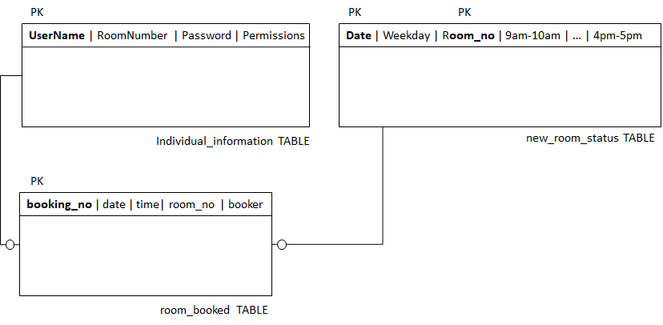
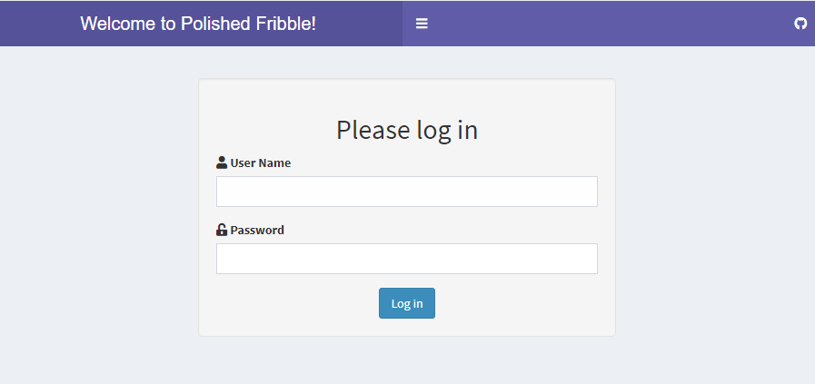
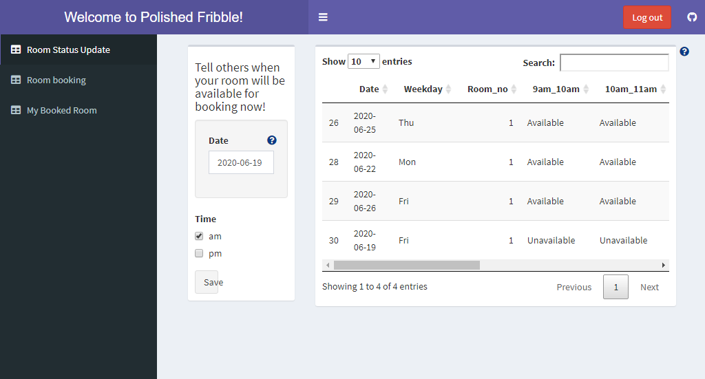
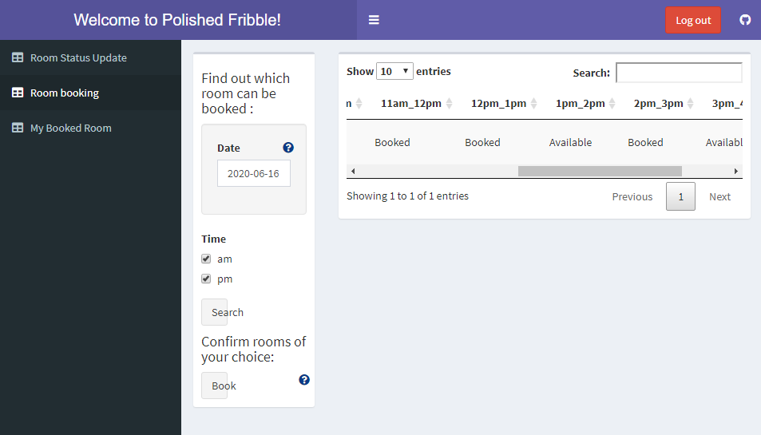
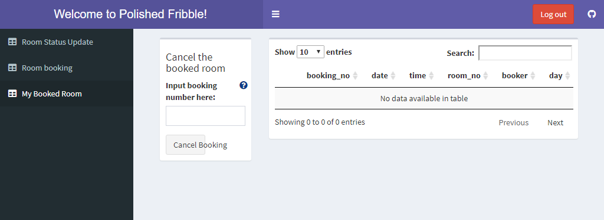

# Polished Fribble

R Shiny login system for UCL Statistical Sciences department room booking.

### Background

It would be helpful for everyone to have access to information about which rooms are available at any given time.

This is both a room _unbooker_ as well as a room _booker_ app, since it provides information on which
rooms are free and defaults to that they are not.

### Requirements

There are 2 main types of user and related functions:

1. A room _owner_ can edit their rooms upcoming availability.
2. A room _user_ can query available rooms and make a reservation.

#### Room owner

- Can indicate their room is free for hours or a whole day 
- Can change their room availability

#### Room user

- Can search all available rooms by room number, date and time
- Can book a room for several hours
- Can change booking room, date and time
- Can delete booking

The database can be described with the following diagram.

## Example

#### Log-in

Log in with a password to the app.

#### Room status

This tab is to make your own room avialable for others to book.

#### Room booking

Search for available rooms.

### Booked room

Which rooms have you booked and cancel them using the booking reference number.

